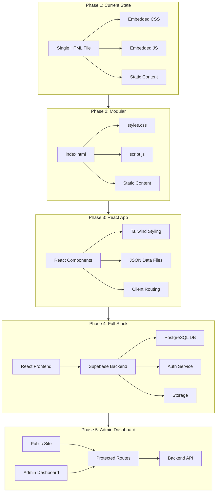
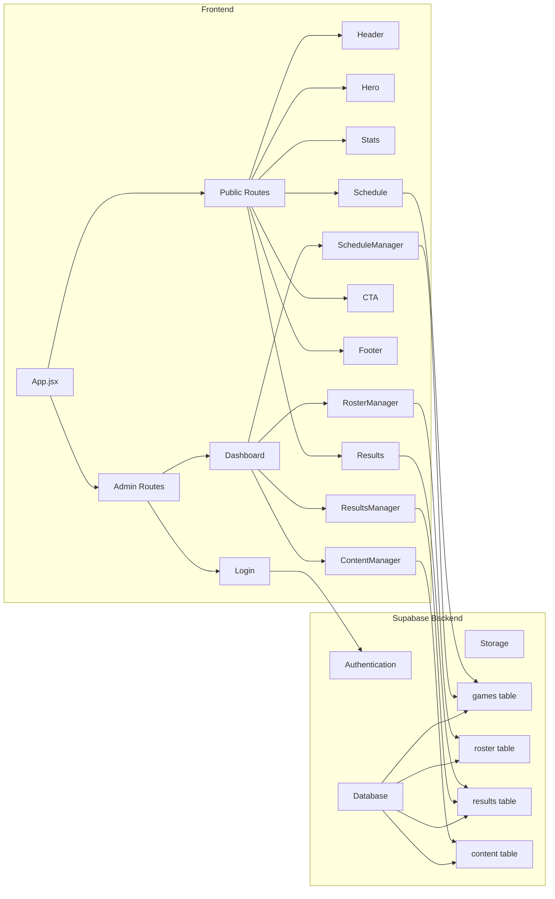

# Shaler Lacrosse Website - Architecture & Implementation Plan

## Project Overview

Transform the current single-file HTML website into a modern, maintainable React application with an admin dashboard for coach content management. The project follows a phased approach to ensure the site remains live throughout development.

## Technology Stack Recommendations

### Phase 1-2: Static Hosting
**Recommended: Netlify** (Best for this use case)
- Drag-and-drop deployment
- Automatic HTTPS
- Free custom domain support
- Instant rollbacks
- Excellent free tier
- Simple CI/CD with GitHub integration

**Alternatives:**
- **Vercel**: Similar to Netlify, excellent React support for later phases
- **GitHub Pages**: Good for static sites, but less features for later React deployment

### Phase 3: React Framework
**Recommended: Vite + React**
- Fastest build tool and dev server
- Optimal for modern React development
- Built-in TypeScript support (optional)
- Excellent plugin ecosystem
- Better than Create React App for performance

### Phase 4: Backend & Database
**Recommended: Supabase** (Best for free tier + features)
- Free tier: 500MB database, 50MB file storage, unlimited API requests
- PostgreSQL database (more powerful than Firebase)
- Built-in authentication with social providers
- Row Level Security for data protection
- Real-time subscriptions
- RESTful API and client libraries
- Open source alternative to Firebase

**Alternatives:**
- **Firebase**: Great ecosystem, but limited free tier (50k reads/day)
- **Appwrite**: Self-hosted option, more control but requires server management

### Styling Framework
**Tailwind CSS** (as requested)
- Utility-first approach
- Smaller bundle size than traditional CSS frameworks
- Easy to maintain custom design
- Excellent with React components
- Can replicate existing design exactly

## Architecture Evolution



## Detailed Component Architecture (Phase 3-5)



## Database Schema (Phase 4)

### games table
| Field | Type | Description |
|-------|------|-------------|
| id | uuid | Primary key |
| date | date | Game date |
| time | time | Game time |
| opponent | text | Opponent team name |
| location | text | Game location |
| is_home | boolean | Home vs Away |
| game_type | text | Regular, playoff, etc |
| created_at | timestamp | Record creation time |
| updated_at | timestamp | Last update time |

### results table
| Field | Type | Description |
|-------|------|-------------|
| id | uuid | Primary key |
| game_id | uuid | Foreign key to games |
| titans_score | integer | Shaler score |
| opponent_score | integer | Opponent score |
| leading_scorer | text | Top scorer name |
| leading_scorer_goals | integer | Goals scored |
| attendance | integer | Optional attendance |
| notes | text | Game notes |

### roster table
| Field | Type | Description |
|-------|------|-------------|
| id | uuid | Primary key |
| player_name | text | Full name |
| jersey_number | integer | Jersey number |
| position | text | Position played |
| grade | integer | Grade level |
| photo_url | text | Optional photo |
| is_active | boolean | Active status |

### content table
| Field | Type | Description |
|-------|------|-------------|
| id | uuid | Primary key |
| key | text | Content identifier |
| value | jsonb | Flexible content storage |
| updated_at | timestamp | Last update time |

## Deployment Strategy

### Phase 1 Deployment (Immediate)
1. Create Netlify account
2. Drag and drop [`shaler-lacrosse.html`](shaler-lacrosse.html) to Netlify
3. Get live URL immediately
4. Optional: Configure custom domain

### Phase 2 Deployment
1. Create Git repository
2. Connect Netlify to GitHub repo
3. Auto-deploy on push to main branch

### Phase 3 Deployment
1. Build React app: `npm run build`
2. Netlify auto-detects Vite config
3. Deploy production build
4. Environment variables in Netlify UI

### Phase 4-5 Deployment
1. Set up Supabase project
2. Configure environment variables in Netlify
3. Add Supabase credentials to `.env`
4. Deploy with backend integration
5. Test authentication flow

## Security Considerations

### Authentication
- Use Supabase Auth for secure login
- Implement email verification for coaches
- Add password reset functionality
- Consider 2FA for admin accounts

### Data Protection
- Enable Row Level Security in Supabase
- Restrict write access to authenticated coaches
- Public read access for game/roster data
- Private admin-only data in separate tables

### Environment Variables
- Never commit API keys to Git
- Use `.env.local` for local development
- Store secrets in Netlify environment variables
- Use different keys for dev/production

## Migration Path from Current Design

### CSS Migration to Tailwind
The current design uses:
- Custom CSS variables: `--navy`, `--red`, `--off-white`
- Custom animations: `fadeSlideUp`, `pulse`
- Responsive breakpoints: 768px, 1024px

Tailwind equivalent:
```javascript
// tailwind.config.js
module.exports = {
  theme: {
    extend: {
      colors: {
        navy: '#07174a',
        red: '#c02031',
        'off-white': '#f8f9fc',
      },
      fontFamily: {
        'bebas': ['"Bebas Neue"', 'sans-serif'],
        'outfit': ['Outfit', 'sans-serif'],
      },
    },
  },
}
```

### Component Mapping
| Current Section | React Component | Data Source |
|----------------|----------------|-------------|
| Navigation | `Header.jsx` | Static |
| Hero Section | `Hero.jsx` | Supabase content table |
| Stats Bar | `Stats.jsx` | Calculated from DB |
| Schedule | `Schedule.jsx` | Supabase games table |
| Recent Result | `Results.jsx` | Supabase results table |
| CTA Cards | `CTA.jsx` | Static |
| Footer | `Footer.jsx` | Supabase content table |

## Cost Analysis (All Free Tiers)

### Netlify
- Bandwidth: 100GB/month
- Build minutes: 300/month
- Sites: Unlimited
- **Cost: $0/month**

### Supabase
- Database: 500MB
- Storage: 1GB
- Bandwidth: 2GB
- Auth users: Unlimited
- **Cost: $0/month**

### Domain (Optional)
- `.com` domain: ~$12/year
- or use free `.netlify.app` subdomain

### Total Monthly Cost: $0
### Total Annual Cost: $0-12 (optional domain)

## Future Enhancements (Beyond Phase 5)

### Potential Features
- Player statistics tracking
- Photo gallery with game photos
- Email notifications for schedule changes
- Calendar export (iCal format)
- Fan engagement: comments, reactions
- SEO optimization for local search
- Analytics dashboard for coaches
- Mobile app using React Native
- Online merchandise store
- Ticket sales integration

### Performance Optimizations
- Image optimization with Cloudinary
- Lazy loading for images
- Code splitting for faster loads
- Service worker for offline access
- CDN for static assets

## Risk Mitigation

### Potential Issues & Solutions

**Issue**: Free tier limitations reached
**Solution**: Supabase and Netlify have generous free tiers; can upgrade individually if needed (~$25-50/month total)

**Issue**: Data loss during migration
**Solution**: Keep backups at each phase; use Git version control; test migrations on staging

**Issue**: Coach difficulty using admin panel
**Solution**: Simple, intuitive UI; provide training documentation; add helpful tooltips

**Issue**: Site downtime during updates
**Solution**: Use staging environments; test thoroughly; Netlify has instant rollback

## Success Metrics

### Phase 1-2
- Site loads in under 2 seconds
- Mobile responsive on all devices
- Zero console errors

### Phase 3
- Component-based architecture
- Reusable code patterns
- Lighthouse score > 90

### Phase 4-5
- Coach can update schedule in under 2 minutes
- Authentication works reliably
- Real-time updates without page refresh
- Admin dashboard intuitive enough to use without training
