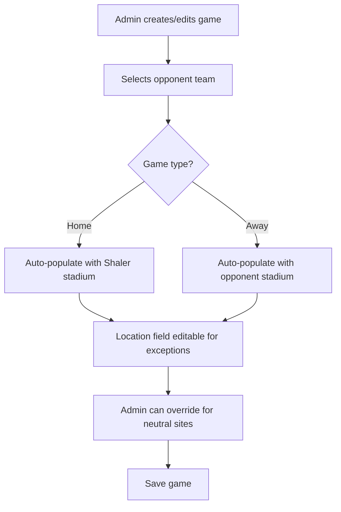

# Stadium Integration Plan

## Overview
Integrate stadium/field information into the teams management system so that when scheduling games, the location is automatically populated based on whether the game is home or away.

## Current State
- Teams table exists with basic team information (name, logo, colors, conference)
- Games table has `location` field that requires manual text entry
- Games table has `game_type` field (home/away) and `opponent_team_id` reference
- Home team ID is stored in settings table

## Proposed Solution

### Database Changes
Add a `stadium` column to the teams table to store each team's home field location. This allows:
- Shaler Area Titans to have their designated home field
- Each opponent team to have their home field stored
- Automatic location population based on game type

### User Experience Flow

### Auto-Population Logic

**When game_type = 'home':**
1. Fetch home team ID from settings table
2. Query teams table for home team's stadium
3. Auto-populate location field with home team stadium

**When game_type = 'away':**
1. Use selected opponent_team_id
2. Query teams table for opponent's stadium
3. Auto-populate location field with opponent stadium

**Editable Override:**
- Location field remains editable after auto-population
- Allows for neutral site games or special circumstances
- Admin can manually change if needed

## Implementation Steps

### 1. Database Migration
- Add `stadium` TEXT column to teams table
- Make column nullable to allow gradual data entry
- No index needed as not used for queries

### 2. Update AdminTeams Component
**File:** [`src/components/admin/AdminTeams.jsx`](../src/components/admin/AdminTeams.jsx)

Add stadium field to:
- `formData` state initialization (line 209)
- Form UI in `TeamForm` component
- Position after conference field, before notes

### 3. Update AdminGames Component
**File:** [`src/components/admin/AdminGames.jsx`](../src/components/admin/AdminGames.jsx)

Add stadium auto-population:
- Watch for changes to `game_type` and `opponent_team_id`
- Use `useEffect` to trigger stadium fetch
- Query appropriate team's stadium based on game type
- Update location field with fetched stadium
- Keep location field editable for manual override

### 4. Stadium Fetch Logic
Create helper function in GameForm component:
- Fetch home team stadium when game_type is 'home'
- Fetch opponent team stadium when game_type is 'away'
- Handle cases where stadium is not set (keep location as is)
- Only auto-populate if location is empty OR user confirms override

## Technical Considerations

### Data Integrity
- Existing games with manual locations remain unchanged
- Stadium field is optional during team creation/editing
- System falls back gracefully if stadium not set

### User Control
- Auto-population is a convenience, not a constraint
- Admin maintains full control over final location value
- Can accommodate exceptions like neutral sites, tournaments, etc.

### Performance
- Stadium fetch happens client-side on form interaction
- Single query per game type/opponent change
- No impact on page load or list views

## Testing Checklist

- [ ] Create new team with stadium field
- [ ] Edit existing team to add stadium
- [ ] Create home game - verify Shaler stadium auto-populates
- [ ] Create away game - verify opponent stadium auto-populates
- [ ] Change game type from home to away - verify location updates
- [ ] Manually override location - verify it stays overridden
- [ ] Create game when team has no stadium - verify graceful handling
- [ ] Verify existing games display correctly

## Files to Modify

1. **Database Migration File** (new file to create)
   - Add stadium column to teams table

2. **src/components/admin/AdminTeams.jsx**
   - Add stadium field to form
   - Update formData state
   - Add UI input for stadium

3. **src/components/admin/AdminGames.jsx**
   - Add useEffect for auto-population
   - Add stadium fetch logic
   - Connect game_type/opponent changes to location updates

## Future Enhancements

- Consider adding address/coordinates for mapping
- Add driving directions link
- Display stadium capacity
- Track game attendance vs capacity
